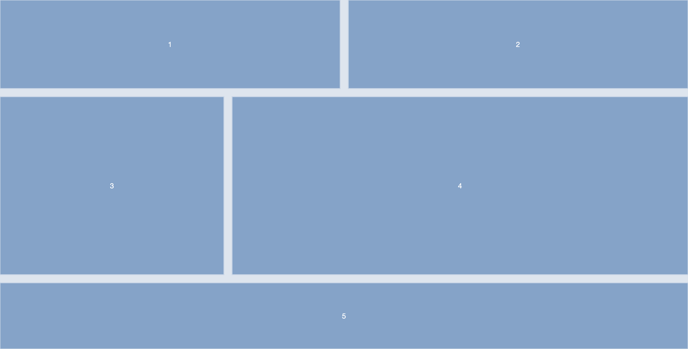

# Opdracht beschrijving

### Eindresultaat
Maak de volgende layout:

### Randvoorwaarden
* De kleuren die gebruikt zijn: `hsl(212, 36%, 90%)` en `hsl(212, 43%, 65%)`;
* De kolommen zijn allemaal gelijke fracties
* De rijen zijn respectievelijk `200`, `400` en `150` pixels hoog
* Verzin zelf een leuke mobiele-view!

