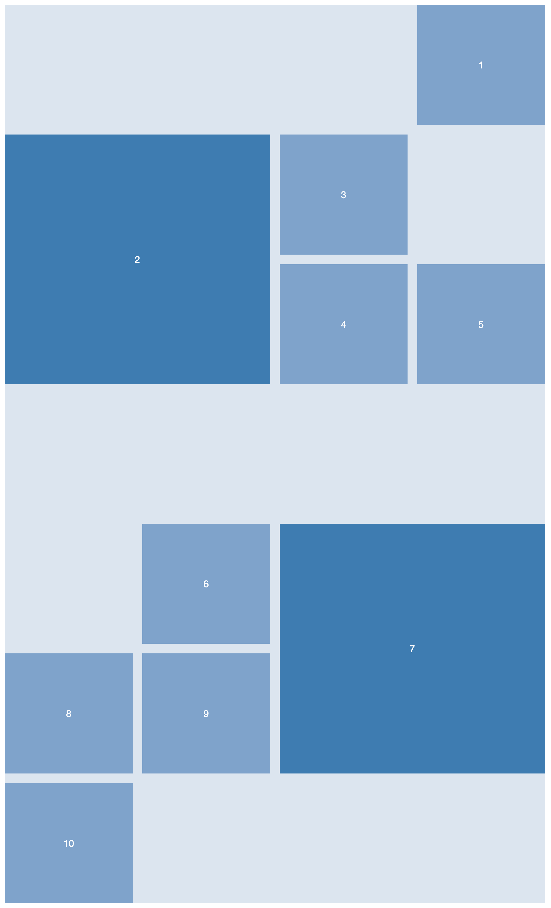

# Opdracht beschrijving

### Eindresultaat
Maak de volgende layout:

### Randvoorwaarden
* De kleuren die gebruikt zijn: `hsl(212, 36%, 90%)` en `hsl(212, 43%, 65%)` en `hsl(208, 48%, 47%)`;
* Zorg dat de container `900px` breed is
* Vlak 2 en 7 zijn donkerder dan de rest en de cijfers staan altijd in het midden
* De kolommen en rijen zijn allemaal gelijke fracties

