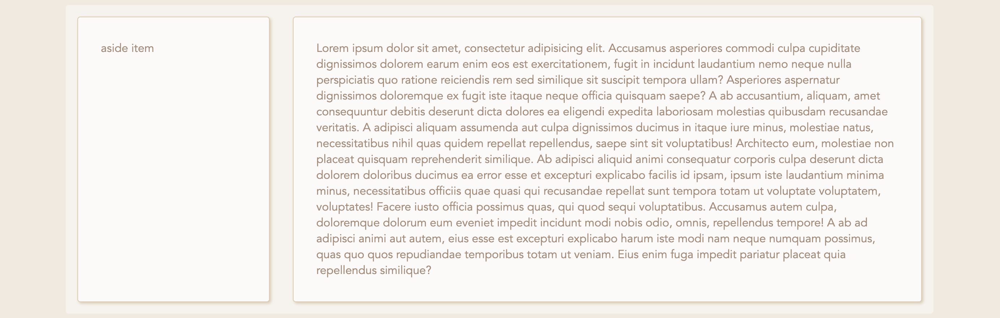
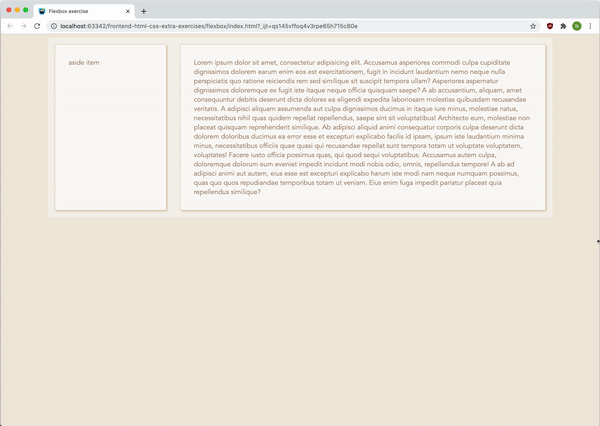

# Opdracht beschrijving

### Beschrijving
Je gaat een layout maken  waarbij de zijbalk hetzelfde blijft, maar alleen de content mee schaalt op het moment dat de schermgrootte wordt aangepast.
Op mobiel komen beide elementen netjes onder elkaar te staan. Je doet dit met flexbox!

### Eindresultaat

##### Desktop view

##### In actie > mobiel

### Randvoorwaarden
* Alle benodigde HTML-elementen staan al in het `index.html` bestand. Je mag hier niets meer aan veranderen.
* Vul de huidige CSS aan in `styles.css`
* De container waar beide elementen in zitten moet `1200px` breed zijn en in het midden uitgelijnt
* De aside heeft een vaste breedte van `300px` en mag niet verder groeien of krimpen als de schermgrootte aangepast wordt
* Het content blok mag bij het aanpassen van de schermgrootte _wel_ groter en kleiner worden. Sterker nog: dat moet zelfs!
* Alleen op _mobiele schermen_ (gebruik een media query) moeten de aside en content blok onder elkaar komen te staan.
Dan mogen ze beiden evenveel groeien als krimpen.
