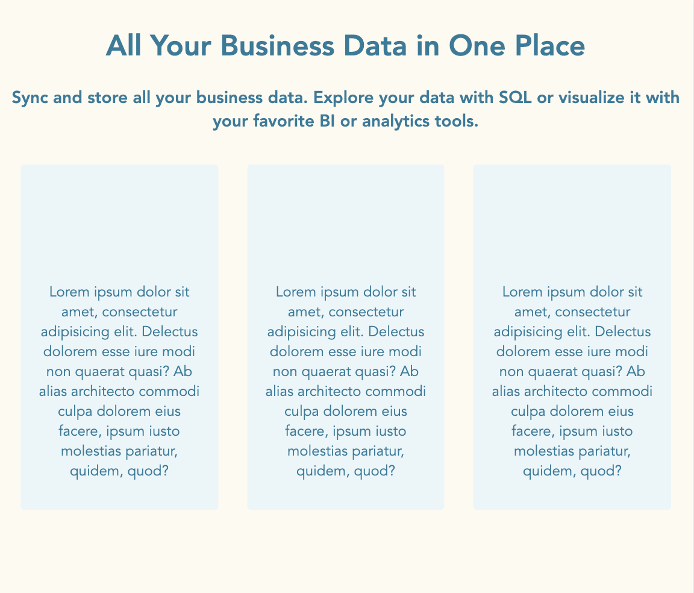
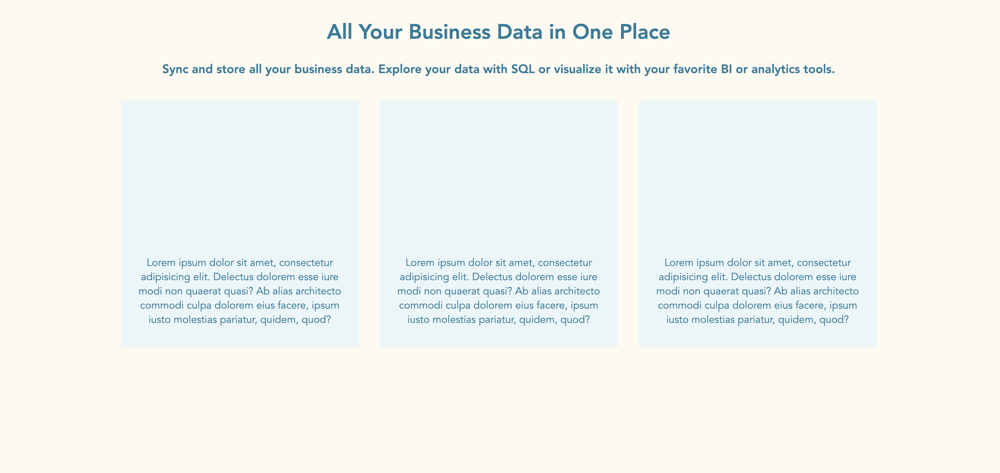

# Opdracht beschrijving

### Beschrijving
Je gaat de standaard landings-pagina van zo'n beetje ieder bedrijf maken: titel, subtitel en drie uitgelichte items.
Het moet er goed uitzien op zowel mobiel, tablet als desktops.

### Eindresultaat

##### Mobile view

##### Tablet view

##### Desktop view

### Randvoorwaarden
* De kleuren die gebruikt zijn: `hsl(211, 65%, 14%)` (item), `hsl(40, 88%, 97%)` (achtergrond) en `hsl(196, 64%, 37%)` (tekstkleur)
* Alle tekst is in het midden uitgelijnt
* Je mag een "container" maken van `1200px` breed waarin alle onderdelen van de pagina.
* De blauwe blokken en andere belangrijke HTML-elementen mag je zelf maken. Zorg dat er in elk van de blokken een `
`-element zit met daarin 30 woorden
* De blokken hebben een basis-breedte van `215px` en zijn altijd `350px` hoog
* De tekst die erin staat moet altijd aan de onderkant van het blok terecht komen. 