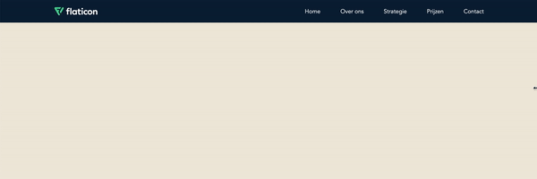

# Opdracht beschrijving

### Beschrijving
Je gaat een menu maken met daarin een logo en menu-items. Zodra de menu-items niet meer in het scherm passen (mobiele aparaten) verdwijnt de lijst en komt er een hamburger-icoontje voor in de plaats!

### Eindresultaat
##### Desktop view

##### Mobile view

##### In actie

### Randvoorwaarden
* De kleuren die gebruikt zijn: `hsl(35, 40%, 91%)` en `hsl(35, 40%, 91%)`;
* Het logo en hamburgericoon zijn bijgevoegd in de assets map, beide zijn SVG's.
* De "container" waarin je alle onderdelen van het menu plaatst, is `1200px` breed.
* De enige plekken waar je `padding` of `margin` mag gebruiken zijn in een CSS-reset of in de buitenste twee elementen. De rest los je op met flexbox.